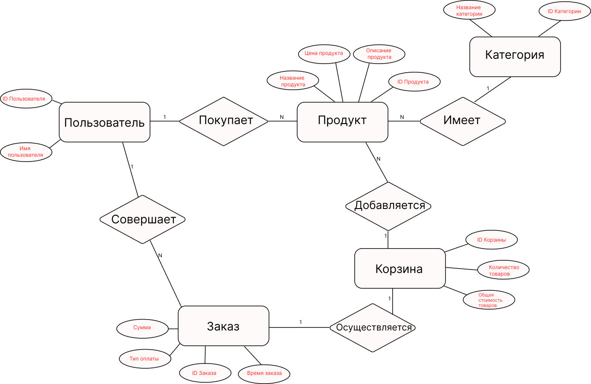

### Cущности и атрибуты интернет-магазина
---
1. **Пользователь.** В этой сущности хранится информация о клиентах:
- `ID пользователя`: уникальный идентификатор пользователя.
- `Имя пользователя`: Имя пользователя.
2. **Продукт.** В этой сущности содержится информация о продуктах, доступных для продажи:
- `ID продукта`: Уникальный идентификатор для товара в магазине.
- `Название продукта`: название продукта.
- `Описание продукта`: Краткое описание функций или назначения продукта.
- `Цена продукта`: Цена, взимаемая за единицу продукта.
3. **Категория.** В этой сущности хранятся категории продуктов.
- `ID категории`: уникальный идентификатор для категории.
- `Название категории`: название категории товара (например, электроники, одежды).
4. **Корзина.** В этой сущности хранятся добавленные в корзину продукты пользователями.
- `ID корзины`: уникальный идентификатор для каждой корзины.
- `Количество товаров`: количество единиц продукта в корзине. 
- `Общая стоимость`: цена за все товары. 
5. **Заказ.** В этой сущности хранятся заказы, созданные пользователями.
- `ID заказа`: уникальный идентификатор для каждого заказа.
- `Время заказа`: дата и время создания заказа.
- `Тип оплаты`: каким способом совершена оплата.
- `Сумма`: Это общая сумма купленного продукта.

<code></code>
